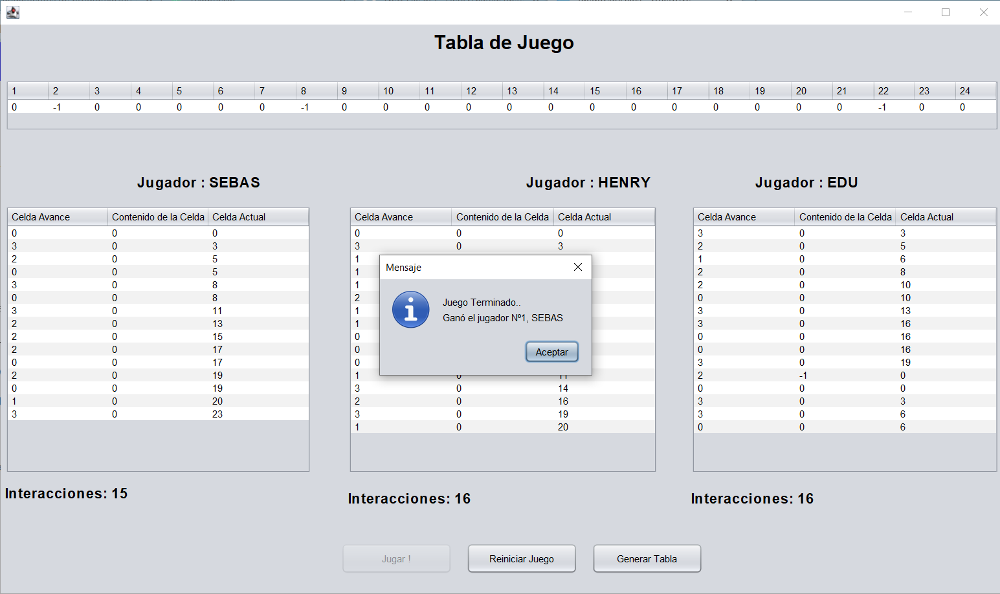

# Juego en JAVA SE con Threats (Hilos)

Se realiza un juego con programación concurrente (Threats) en Java con fines de aprendizaje sobre este tema.
## Reglas y compartamiento del Juego.

- El juego contiene un vector de 25 casillas, las cuales están llenas de 0.
- Al iniciar el juego, tres campos de una JTable deben ser llenados con el valor -1. Los campos son elegidos de forma aleatoria entre todas las posiciones del jTable. Si se re- pite alguna posición generada en el vector, se debe hacer nuevamente ya que deben resultar tres campos del vector llenos con -1.
- Al iniciar el juego, se instancian los hilos jugadores y comienzan a ejecutarse.
- Participarán 3 jugadores, cada uno de los cuales es un hilo e inicia en la posición cero del JTable. El jugador lleva el control de su posición en la JTable, y cada uno tiene un nombre y un número asignados.
- El juego finaliza en el momento en que uno de los jugadores se encuentre en la posición 24, si eso sucede deben detenerse los demás hilos.
- Durante el juego se deben imprimir las posiciones donde avanzan los competidores.
- Se ´programa la clase padre correspondiente al Juego. Debe programarse la clase completa y todos los métodos necesarios para ejecutar la funcionalidad mencionada.
- Se programa la clase Jugador. Se debe programar la clase completa y todos los métodos necesarios para ejecutar la funcionalidad mencionada.
- Se programa el formulario. Se deben declarar e inicializar los hilos, además de mostrar su funcionamiento.

## Feedback

If you have any feedback, please reach out to us at hsniama@utpl.edu.ec

## 🔗 Links

